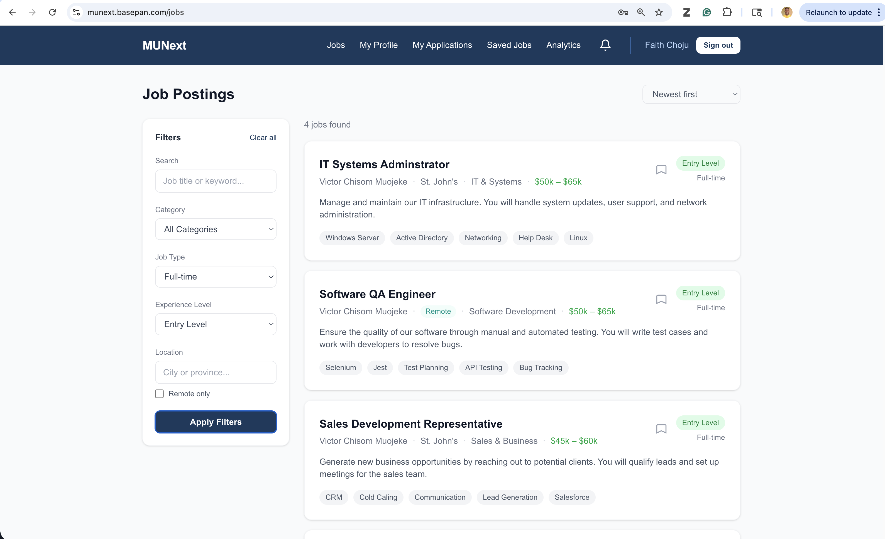
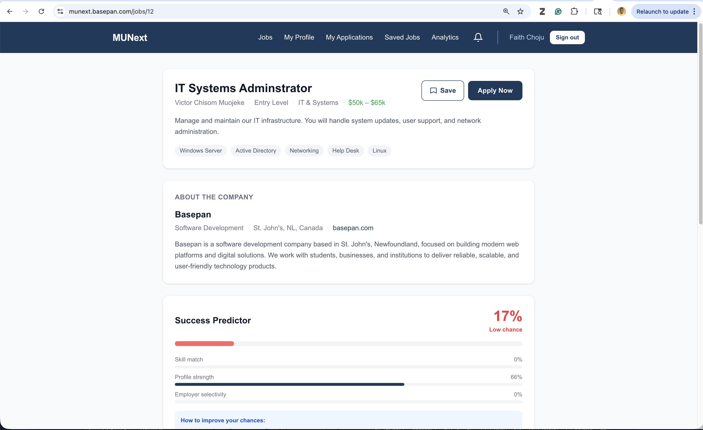
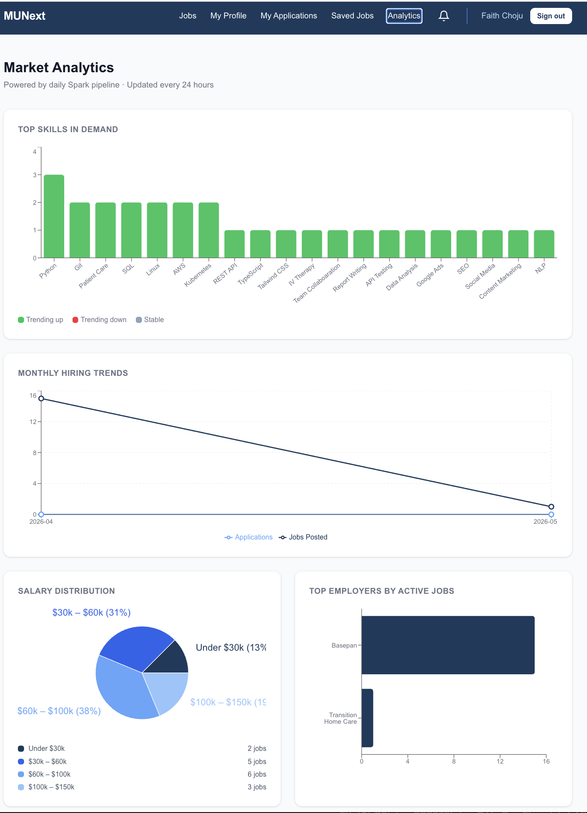
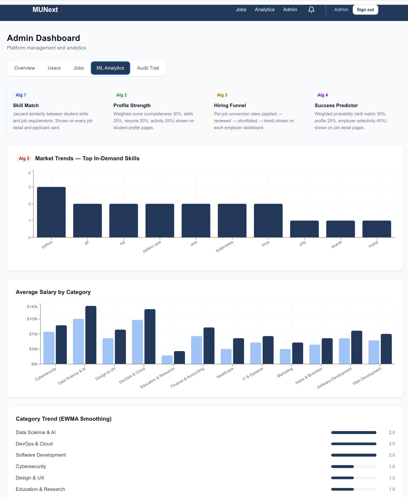

# MUNext v2

**Live at [munext.basepan.com](https://munext.basepan.com)**

MUNext is a full-stack job board built for Memorial University students, alumni, and employers. Students discover relevant jobs through a skill match score, apply with cover letters, and track application status in real time. Employers manage their hiring pipeline and message applicants directly. A daily Apache Spark pipeline analyses job market trends and surfaces them on a live Recharts dashboard — no manual data refresh needed.

Built as a portfolio project to demonstrate end-to-end software engineering: modular Laravel API, Next.js frontend, 5 pure-PHP ML algorithms, PySpark data pipelines, and GitHub Actions automation.

## Screenshots

| Job Listings | Job Detail + Skill Match |
|---|---|
|  |  |

| Analytics Dashboard | Admin ML Panel |
|---|---|
|  |  |

## Tech Stack

| Layer | Technology |
|---|---|
| Backend | Laravel 13, PHP 8.3, Sanctum, Spatie Activity Log |
| Frontend | Next.js 16, TypeScript, TanStack Query, Recharts |
| Database | MySQL (production) / PostgreSQL 16 (local Docker) |
| Analytics | Apache Spark 3 (PySpark), JDBC, GitHub Actions cron |
| Queue | Laravel database queue + cron worker |
| Testing | Pest |
| DevOps | Docker, Docker Compose, Nginx (local) / Hostinger (production) |

## Data Flow

```
MySQL (job_postings, applications)
        │
        │  daily at 3am UTC (GitHub Actions)
        ▼
  PySpark pipelines
  ┌─────────────────────┐
  │ jobs_analytics.py   │──► analytics_jobs_summary
  │ skills_demand.py    │──► analytics_skills_demand
  │ hiring_trends.py    │──► analytics_hiring_trends
  └─────────────────────┘
        │
        │  Laravel reads via Eloquent
        ▼
  GET /api/v1/analytics/*
        │
        │  TanStack Query + Recharts
        ▼
  munext.basepan.com/analytics
```

## Project Structure

```
munext-v2/
  backend/
    Modules/
      Auth/           ← Register, login, logout
      Jobs/           ← Job postings, applications, bookmarks, skill match
      Students/       ← Student profiles
      Employer/       ← Employer profiles
      ML/             ← 5 pure-PHP ML algorithms
      Admin/          ← User & job moderation, platform stats
      Analytics/      ← 4 analytics endpoints (reads Spark output tables)
      Notifications/  ← In-app notifications
      Messages/       ← Per-application chat threads
    app/
      Services/
        MLService.php ← All 5 ML algorithms (pure PHP, no external library)
    database/migrations/
  frontend/
    app/
      (auth)/         ← Login, register
      (dashboard)/
        jobs/         ← Job listing with filters, pagination, bookmarks
        jobs/[id]/    ← Job detail, skill match chart, success predictor
        jobs/bookmarks/          ← Saved jobs
        profile/                 ← Student profile + strength score
        employer/                ← Employer dashboard
        employer/applicants/[jobId]/  ← Applicant management
        employer/messages/       ← Employer message inbox
        messages/[applicationId]/← Per-application chat thread
        admin/                   ← Admin dashboard + ML analytics
        analytics/               ← Market analytics dashboard (Recharts)
        notifications/           ← In-app notifications
      about/          ← About Us page
      contact/        ← Contact Us (functional form)
      privacy/        ← Privacy Policy
      terms/          ← Terms of Use
    lib/
      api.ts          ← All API calls
      types.ts        ← All TypeScript interfaces
  spark/
    pipelines/
      jobs_analytics.py   ← Groups jobs by category/type/level
      skills_demand.py    ← Explodes skills array, counts + trends
      hiring_trends.py    ← Jobs posted vs applications per month
    utils/
      db_connector.py     ← JDBC helpers (get_spark, read_table, write_table)
    docker-compose.yml    ← Local Spark runner (3 services)
    requirements.txt
  .github/
    workflows/
      spark_pipeline.yml  ← Runs all 3 pipelines daily at 3am UTC
  docker/
  docker-compose.yml
```

## Prerequisites

- Docker Desktop
- Git

## Running Locally

**1. Clone the repo**

```bash
git clone https://github.com/portalzone/munext-v2.git
cd munext-v2
```

**2. Set up environment files**

```bash
cp backend/.env.example backend/.env
cp frontend/.env.example frontend/.env.local
```

`backend/.env` database block:

```env
DB_CONNECTION=pgsql
DB_HOST=postgres
DB_PORT=5432
DB_DATABASE=munext
DB_USERNAME=munext
DB_PASSWORD=secret
```

`frontend/.env.local`:

```env
NEXT_PUBLIC_API_URL=http://localhost:8000/api/v1
```

**3. Configure mail (optional — for email delivery)**

In `backend/.env`, set your SMTP credentials. Example for Hostinger:

```env
MAIL_MAILER=smtp
MAIL_SCHEME=smtp
MAIL_HOST=smtp.hostinger.com
MAIL_PORT=587
MAIL_USERNAME=your@email.com
MAIL_PASSWORD=yourpassword
MAIL_FROM_ADDRESS="your@email.com"
MAIL_FROM_NAME="MUNext"
```

If mail is not configured, emails log to `backend/storage/logs/laravel.log`.

**4. Start the full stack**

```bash
docker compose up --build
```

This starts 5 containers: `app` (PHP-FPM), `nginx`, `postgres`, `frontend`, and `worker` (queue processor).

**5. Run migrations**

```bash
docker compose exec app php artisan migrate
```

**6. (Optional) Seed an admin user**

```bash
docker compose exec app php artisan tinker
```

```php
\App\Models\User::create([
    'name'     => 'Admin',
    'email'    => 'admin@example.com',
    'password' => bcrypt('password'),
    'role'     => 'admin',
]);
```

**7. Access the app**

| Service | URL |
|---|---|
| Frontend | http://localhost:3001 |
| Laravel API | http://localhost:8000/api/v1 |
| PostgreSQL | localhost:5433 (user: `munext`, db: `munext`) |

## Running the Spark Pipelines Locally

Requires Docker Desktop. The MySQL JDBC driver is downloaded automatically.

```bash
cd spark
cp .env.example .env   # fill in DB credentials
docker compose run --rm spark   # jobs_analytics
docker compose run --rm skills  # skills_demand
docker compose run --rm trends  # hiring_trends
```

In production, all three run automatically every day at 3am UTC via GitHub Actions (`.github/workflows/spark_pipeline.yml`). Set these repository secrets in GitHub:

| Secret | Value |
|---|---|
| DB_HOST | Your MySQL host |
| DB_PORT | 3306 |
| DB_DATABASE | Database name |
| DB_USERNAME | MySQL user |
| DB_PASSWORD | MySQL password |

## Running Tests

```bash
docker compose exec app php artisan test
```

All Pest tests must pass before any feature is considered done. Each endpoint has at minimum: happy path, unauthenticated access, and invalid input tests.

## API Endpoints

All routes prefixed `/api/v1/`. Sanctum token in `Authorization: Bearer <token>` header.

### Auth
| Method | Endpoint | Access |
|---|---|---|
| POST | /auth/register | Public |
| POST | /auth/login | Public |
| GET  | /auth/me | Authenticated |
| POST | /auth/logout | Authenticated |

### Jobs
| Method | Endpoint | Access |
|---|---|---|
| GET  | /jobs | Authenticated |
| POST | /jobs | Employer |
| GET  | /jobs/{id} | Authenticated |
| PUT  | /jobs/{id} | Job owner |
| DELETE | /jobs/{id} | Job owner |
| GET  | /jobs/my-jobs | Employer |
| GET  | /jobs/bookmarks | Student |
| GET  | /jobs/{id}/bookmark | Student |
| POST | /jobs/{id}/bookmark | Student (toggle) |
| POST | /jobs/{id}/apply | Student (throttle: 5/min) |
| GET  | /jobs/{id}/applicants | Job owner |
| PUT  | /jobs/{id}/applicants/{id} | Job owner |
| GET  | /my-applications | Student |

### Students
| Method | Endpoint | Access |
|---|---|---|
| GET  | /students | Authenticated |
| POST | /students | Student |
| GET  | /students/my-profile | Student |
| GET  | /students/{id} | Authenticated |
| PUT  | /students/{id} | Profile owner |

### Analytics
| Method | Endpoint | Description |
|---|---|---|
| GET | /analytics/skills-demand | Top 20 skills by count + trend (Spark) |
| GET | /analytics/hiring-trends | Jobs posted vs applications per month (Spark) |
| GET | /analytics/salary-distribution | Active jobs bucketed by salary range |
| GET | /analytics/top-employers | Top 10 employers by active job count |

**Example — `GET /api/v1/analytics/skills-demand`**
```json
{
  "data": [
    { "skill": "Python", "count": 12, "trend": "up",     "computed_at": "2026-05-19T03:12:00Z" },
    { "skill": "SQL",    "count": 9,  "trend": "stable", "computed_at": "2026-05-19T03:12:00Z" },
    { "skill": "AWS",    "count": 6,  "trend": "down",   "computed_at": "2026-05-19T03:12:00Z" }
  ],
  "message": "Skills demand retrieved successfully",
  "status": 200
}
```

**Example — `GET /api/v1/analytics/hiring-trends`**
```json
{
  "data": [
    { "month": "2026-03", "job_count": 8,  "application_count": 14, "computed_at": "2026-05-19T03:12:00Z" },
    { "month": "2026-04", "job_count": 15, "application_count": 31, "computed_at": "2026-05-19T03:12:00Z" }
  ],
  "message": "Hiring trends retrieved successfully",
  "status": 200
}
```

### ML Algorithms (pure PHP)
| Method | Endpoint | Access | Algorithm |
|---|---|---|---|
| GET | /ml/match/{jobId} | Student | Jaccard skill match |
| GET | /ml/profile-strength | Student | Weighted profile score |
| GET | /ml/predict/{jobId} | Student | Application success predictor |
| GET | /ml/funnel | Employer | Hiring funnel analytics |
| GET | /ml/trends | Admin | EWMA market trend analysis |

### Admin
| Method | Endpoint | Description |
|---|---|---|
| GET | /admin/stats | Platform statistics |
| GET | /admin/users | List all users (search, role filter) |
| PUT | /admin/users/{id}/toggle | Activate / deactivate account |
| PUT | /admin/users/{id}/promote | Promote user to admin |
| PUT | /admin/users/{id}/ban | Ban user with reason |
| PUT | /admin/users/{id}/unban | Remove ban |
| PUT | /admin/users/{id}/approve-employer | Approve employer to post jobs |
| GET | /admin/jobs | List all jobs (search, status filter) |
| PUT | /admin/jobs/{id}/toggle | Activate / deactivate job |
| DELETE | /admin/jobs/{id} | Delete job |
| GET | /admin/audit-log | Paginated Spatie activity log |

### Messages
| Method | Endpoint | Description |
|---|---|---|
| GET | /messages/{applicationId} | Fetch thread for an application |
| POST | /messages/{applicationId} | Send message (supports file attachment) |
| GET | /messages/unread-count | Total unread messages count |
| POST | /messages/broadcast/{jobId} | Employer: message all applicants for a job |

### Notifications
| Method | Endpoint | Access |
|---|---|---|
| GET | /notifications | Authenticated |
| PUT | /notifications/{id}/read | Authenticated |
| PUT | /notifications/read-all | Authenticated |

### Contact
| Method | Endpoint | Access |
|---|---|---|
| POST | /contact | Public |

## Features

### Student
- Job listing with search, category/salary/level filters, and sort
- Bookmark jobs and view a saved jobs list
- Apply with a cover letter (min 50 chars, rate limited)
- Track application status (pending → reviewed → shortlisted → hired/rejected)
- Profile with skills tagging
- Profile strength score (Algorithm 2)
- Skill match chart on job detail (Algorithm 1)
- Application success predictor (Algorithm 4)
- In-app notifications for status changes
- Market analytics dashboard (skills demand, hiring trends, salary ranges)

### Employer
- Post, edit, deactivate job listings with salary range and category
- Must be approved by an admin before posting jobs
- Company profile (name, industry, location, website, description) shown on every job listing
- View applicants per job with cover letter
- Move applicants through hiring pipeline (pending → reviewed → shortlisted → hired/rejected)
- Hiring funnel analytics chart (Algorithm 3)
- Message inbox: view active conversations per job
- Broadcast a message to all applicants on a job

### Admin
- Platform stats (total users, jobs, applications, categories)
- User management: activate/deactivate, ban/unban with reason, promote to admin
- Employer approval: approve or revoke posting rights
- Job moderation: toggle active status, delete
- ML analytics dashboard with all 5 algorithm outputs (Recharts charts)
- Audit trail: paginated Spatie activity log for all sensitive actions

### Messaging
- Per-application chat thread between student and employer
- File attachment support (PDF, Word, images)
- Unread message badge in navbar and message list
- Email notification to recipient on new message (queued)

### Analytics Dashboard (`/analytics`)
- Bar chart: top 20 skills by demand, color-coded by trend (up/down/stable)
- Line chart: monthly jobs posted vs applications submitted
- Pie chart: active jobs bucketed by salary range
- Horizontal bar chart: top 10 employers by active job count
- Data computed by Spark pipelines, updated every 24 hours

### Platform
- Activity log (Spatie) on all sensitive actions: login, apply, status change, job create/delete, ban, promote
- Rate limiting on apply endpoint (5 requests/minute)
- Role-based access control on every endpoint
- Email queue via Laravel database driver + Docker worker container
- In-app notifications for status changes and new job matches
- Contact Us form (public, no login required)
- Static pages: About Us, Privacy Policy, Terms of Use

## Five ML Algorithms (Pure PHP)

All algorithms live in `backend/app/Services/MLService.php`. No Python, no external ML library.

| # | Algorithm | Endpoint | Used by |
|---|---|---|---|
| 1 | Jaccard skill match score | `GET /ml/match/{jobId}` | Job detail page, applicant list |
| 2 | Weighted profile strength score | `GET /ml/profile-strength` | Student profile page |
| 3 | Hiring funnel analytics | `GET /ml/funnel` | Employer dashboard |
| 4 | Application success predictor | `GET /ml/predict/{jobId}` | Job detail page |
| 5 | EWMA market trend analysis | `GET /ml/trends` | Admin ML dashboard |

## Production Deployment (Hostinger)

Live at:
- Frontend: https://munext.basepan.com (Hostinger Node.js app)
- Backend API: https://api.basepan.com (Hostinger shared hosting, PHP 8.3)

**Backend setup**
1. Upload `backend/` contents to `public_html/` on `api.basepan.com`
2. Create `public_html/.env` from `.env.example` — set MySQL credentials, `APP_URL`, `FRONTEND_URL=https://munext.basepan.com`, and SMTP settings
3. Run via SSH:
```bash
/usr/selector/php-cli artisan key:generate
/usr/selector/php-cli artisan migrate
/usr/selector/php-cli artisan storage:link
/usr/selector/php-cli artisan config:cache
/usr/selector/php-cli artisan route:cache
```
4. Add a cron job (every minute) in hPanel to process the queue

**Frontend setup**
1. Zip the `frontend/` source (exclude `node_modules/` and `.next/`)
2. Upload to Hostinger Node.js app for `munext.basepan.com`
3. Set environment variable: `NEXT_PUBLIC_API_URL=https://api.basepan.com/api/v1`
4. Redeploy — Hostinger runs `npm install && npm run build && npm start`

**Spark pipelines (GitHub Actions)**
1. Push the repo to GitHub
2. Add the 5 DB secrets (DB_HOST, DB_PORT, DB_DATABASE, DB_USERNAME, DB_PASSWORD)
3. Enable "Any Host" in Hostinger Remote MySQL settings
4. Pipelines run automatically every day at 3am UTC, or trigger manually from the Actions tab

## Troubleshooting

**Emails not sending (local)**
The queue worker container (`munext_worker`) must be running. Check with:
```bash
docker compose ps
```
If stopped, restart with `docker compose up worker`. Confirm your SMTP credentials in `backend/.env`, then clear config cache:
```bash
docker compose exec app php artisan config:clear
```

**Emails not sending (production)**
Check that the Hostinger cron job is active and the SMTP credentials in `public_html/.env` are correct. Run `/usr/selector/php-cli artisan config:clear` via SSH after any `.env` change.

**Migrations fail / DB connection refused**
Wait ~10 seconds after `docker compose up` for PostgreSQL to be ready, then run:
```bash
docker compose exec app php artisan migrate
```

**Frontend can't reach the API**
Ensure `NEXT_PUBLIC_API_URL=http://localhost:8000/api/v1` is set in `frontend/.env.local` and that the `nginx` container is running on port 8000.

**Employer can't post jobs**
An admin must approve the employer account first. Log in as admin, go to the Users tab in the admin panel, and click "Approve" next to the employer.

**Spark pipeline fails on GitHub Actions**
Check the Actions log. Common causes: DB secrets not set, Hostinger Remote MySQL "Any Host" not enabled, or JDBC JAR download failed (Maven Central timeout — retry the run).

## Quick Start (5 commands)

```bash
git clone https://github.com/portalzone/munext-v2.git && cd munext-v2
cp backend/.env.example backend/.env
cp frontend/.env.example frontend/.env.local
docker compose up --build
docker compose exec app php artisan migrate
```

App is running at http://localhost:3001. API at http://localhost:8000/api/v1.

## Contributing

This is a portfolio project but contributions and feedback are welcome.

1. Fork the repo and create a branch: `git checkout -b feat/your-feature`
2. Follow the existing module pattern — one folder per domain under `backend/Modules/`
3. Every new endpoint needs a Pest test: `docker compose exec app php artisan test`
4. All tests must pass before opening a PR
5. Keep commit messages conventional: `feat:`, `fix:`, `chore:`

For bugs or suggestions open a GitHub issue.

## Contact

Support: support@basepan.com  
Website: munext.basepan.com
